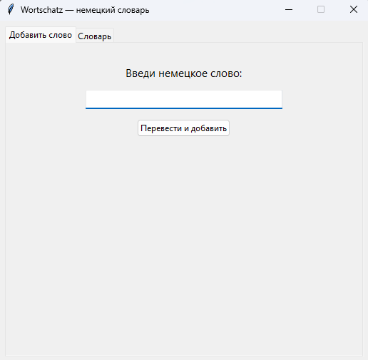
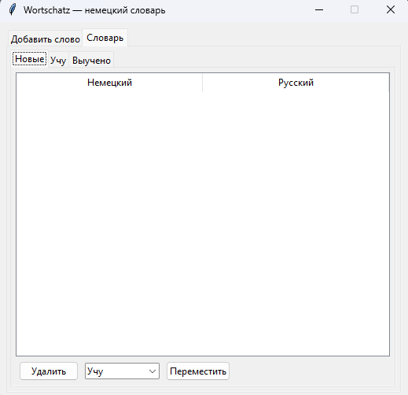
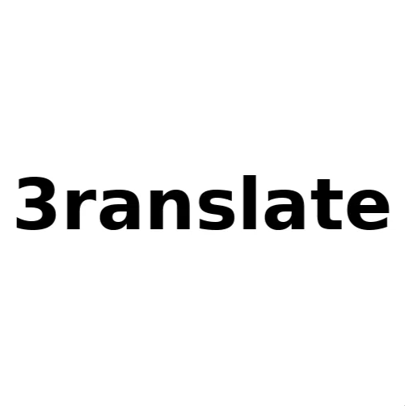

# Wortschatz — German Vocabulary App

A simple desktop app for learning German vocabulary. Type in a German word, it gets automatically translated to Russian and saved to your personal dictionary. Words can be sorted into categories (New / Learning / Learned), deleted, or moved between categories.

## About this project

This is a learning project. The idea, structure, and testing are mine, but the code itself was written in collaboration with an AI (Claude, by Anthropic) as part of learning to program. I intentionally went through the generated code step by step to actually understand how it works, rather than just copy-pasting a finished solution.

Technologies used:
- **Python** — main language
- **tkinter** — graphical interface (windows, tabs, buttons)
- **SQLite** — local word storage
- **deep-translator** — translation via Google Translate

## Screenshot



## Installation & Usage

### Option 1 — just run the executable (easiest)

If the repository includes a pre-built `wortschatz.exe` (in the `dist` folder or under Releases), download it and double-click to run. No need to install Python.

### Option 2 — run from source

Requires [Python 3.10+](https://www.python.org/downloads/) installed.

1. Download the repository (**Code → Download ZIP** button at the top of the page, or `git clone`)
2. Install the translation library:
   ```
   pip install deep-translator
   ```
3. Run the app:
   ```
   python wortschatz.py
   ```

## How to use

- **"Add word" tab** — type a German word and press Enter or the button. It will be translated and added to the "New" category.
- **"Dictionary" tab** — three sub-tabs by category. Select a word to delete it or move it to another category.
- All words are saved in a `wortschatz.db` file next to the program — everything persists between runs.

## Known limitations

- Translation requires an internet connection (uses Google Translate via an unofficial library).
- Categories are currently fixed (New / Learning / Learned) — custom categories aren't supported yet.
- No spell-checking — if you type a word with a typo, it will translate exactly what was typed.

## Planned features

- Web version built with Flask, to use from a smartphone
- Flashcard-style review mode
- Text-to-speech pronunciation
